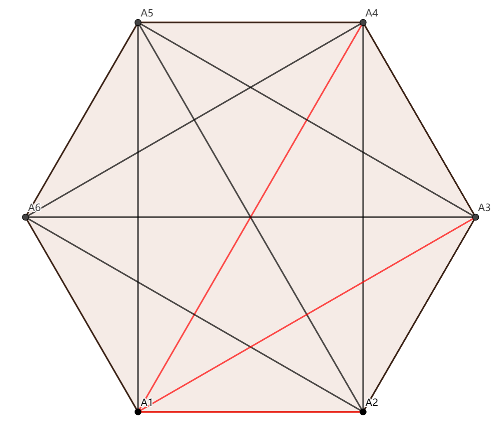
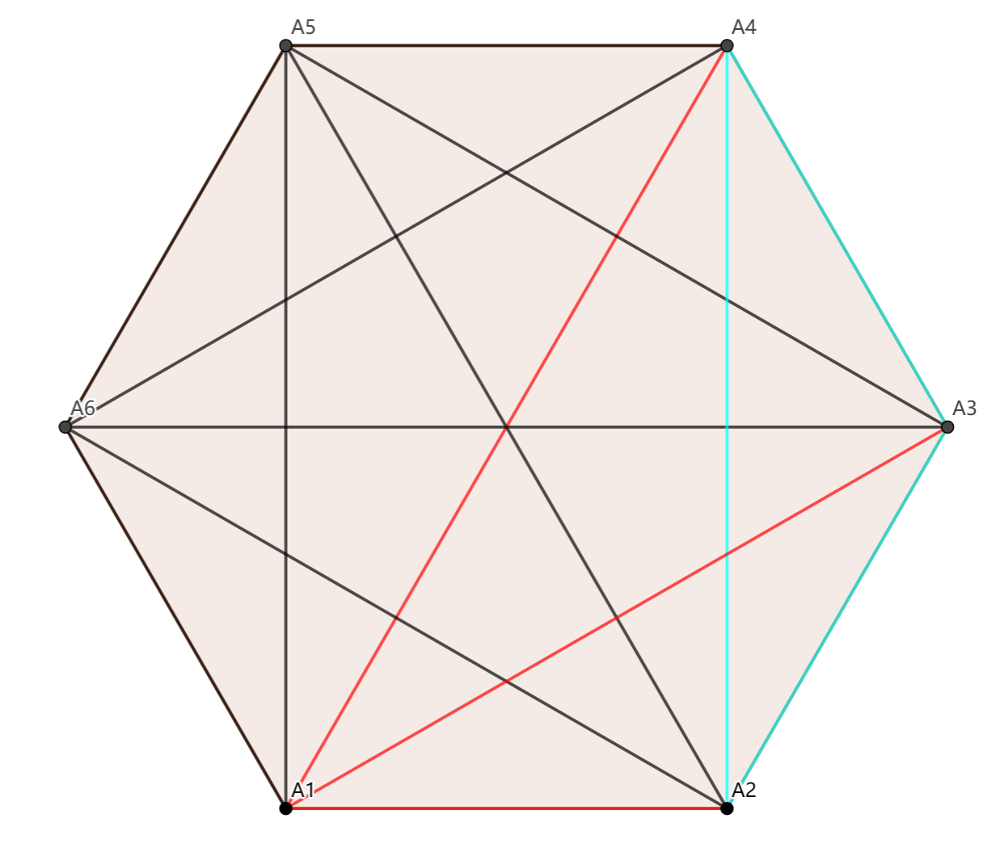
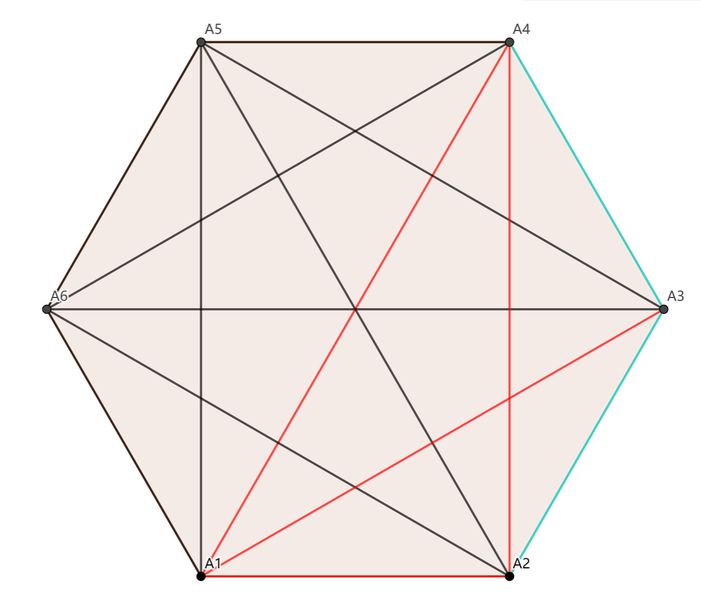

证明Ramsey定理中的六度理论（1）
================
问题叙述：在6个（或者更多的）人中，或者有3个人，他们中的每两个人都互相认识；或者有3个人，他们每两个人都彼此不认识。

**主要思想（方法）：图论 + 鸽巢原理（抽屉原理）**

证明思路：
- 点抽象：将这个6个人抽象成6个点-
- 边抽象：人与人之间的关系（认识或不认识）抽象成该图中的边
- 颜色抽象：认识定义为 ***红色***，不认识定义为 ***蓝色***

由此题目转化为：

$K_6$ -->$K_3$, $K_3$(剑指)

**证明：在一个6个节点的完全图（无向图）中进行二染色（红色、蓝色），必然存在一个同色三角形（三体边颜色均相同的三角形）**

1. 对于某一个点进行鸽巢原理：每个点对应5条边，5条边分别染2种颜色，则至少有三条边被染成同一个颜色
2. 假设使用的点事$A_1$, 令边<$A_1$, $A_2$>,<$A_1$, $A_3$>和<$A_1$, $A_4$>三条边被染成红色，<$A_1$, $A_5$>和<$A_1$, $A_6$>两条边被染成蓝色，如下图所示：\

3. 对于颜色相同（假设为红色）的<$A_1$, $A_2$>,<$A_1$, $A_3$>和<$A_1$, $A_4$>三条边，我们来观察与其相连的三条边<$A_2$, $A_3$>,<$A_2$, $A_4$>和<$A_3$, $A_4$>：
    - 若<$A_2$, $A_3$>,<$A_2$, $A_4$>和<$A_3$, $A_4$>三条边颜色均为蓝色，则该三条边构成一个同色三角形\
    
	- 若<$A_2$, $A_3$>,<$A_2$, $A_4$>和<$A_3$, $A_4$>不同色，则必有一条红色的边，改变能与<$A_1$, $A_2$>,<$A_1$, $A_3$>和<$A_1$, $A_4$>三条边中的两条构成一个同色三角形
    
4. 有上述证明可知必然存在一个同色三角形在这样的一个$K_6$中，得证